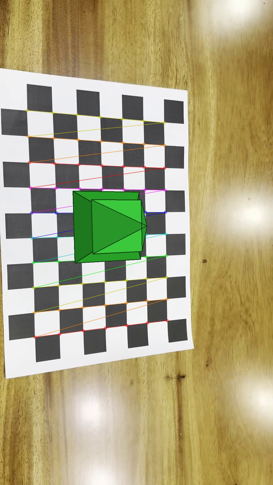
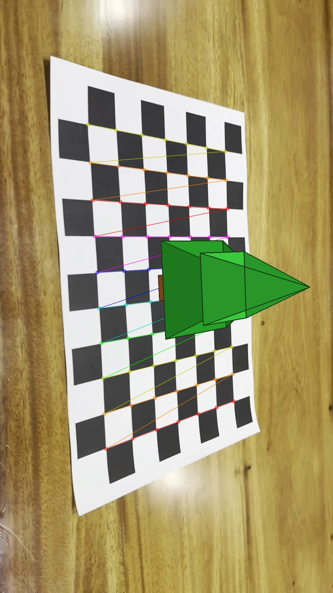

# Chessboard Pose AR

카메라 캘리브레이션 결과를 이용하여 체스보드의 자세를 추정하고, 체스보드 위에 채워진 3D 나무 오브젝트를 증강현실(AR) 형태로 시각화한 프로젝트입니다.

이 프로젝트는 OpenCV를 사용하여 체스보드 코너를 검출하고, `calibrateCamera()`로 카메라 내부 파라미터 및 왜곡 계수를 추정한 뒤, `solvePnP()`를 통해 카메라 자세를 구합니다. 이후 `projectPoints()`를 사용하여 3D 나무 오브젝트를 2D 영상 위에 투영하고, 결과 영상을 저장합니다.

---

## 소개

체스보드 패턴은 카메라 캘리브레이션과 자세 추정에 널리 사용되는 기준 패턴입니다.  
이 프로젝트에서는 직접 촬영한 체스보드 영상을 이용하여 카메라를 캘리브레이션하고, 같은 체스보드를 기준으로 카메라 자세를 추정한 뒤, 체스보드 위에 채워진 3D 나무 오브젝트를 렌더링했습니다.

---

## 주요 기능

- 체스보드 영상에서 내부 코너 검출
- 카메라 내부 파라미터 추정
- 렌즈 왜곡 계수 추정
- 재투영 오차(RMSE) 계산
- `solvePnP()`를 이용한 카메라 자세 추정
- 체스보드 위에 채워진 3D 나무 AR 오브젝트 시각화
- 결과 영상 저장
- 결과 스크린샷 저장

---

## 개발 환경

- Python 3
- OpenCV
- NumPy
- VS Code

---

## 프로젝트 구조

    chessboard-pose-ar/
    ├─ data/
    │  ├─ calibration_video_01.mp4
    │  └─ calibration_video_02.mp4
    ├─ output/
    │  ├─ calibration_result.npz
    │  ├─ ar_result.mp4
    │  ├─ demo_frame_01.jpg
    │  ├─ demo_frame_02.jpg
    │  └─ corners_preview/
    ├─ src/
    │  ├─ camera_calibration.py
    │  └─ pose_estimation_ar.py
    └─ README.md

---

## 체스보드 설정

- 내부 코너 개수: **7 x 10**
- 한 칸 크기: **25 mm**

체스보드는 평평한 바닥에 놓고 촬영했으며, 정면에 가까운 시점뿐 아니라 비스듬한 시점, 거리 변화, 화면 내 위치 변화를 포함하도록 촬영했습니다.

---

## 데이터 수집 방법

체스보드 패턴을 출력한 뒤 스마트폰 카메라를 이용하여 영상을 촬영했습니다.

촬영 시 아래 조건을 반영했습니다.

- 체스보드 전체가 화면에 보이도록 촬영
- 정면에 가까운 시점 포함
- 좌우로 기울어진 시점 포함
- 위에서 내려다보는 시점 포함
- 가까운 거리 / 먼 거리 포함
- 화면 중앙 및 가장자리 쪽 배치 포함

이처럼 다양한 시점과 위치에서 체스보드를 촬영하면, 카메라 캘리브레이션과 자세 추정의 안정성을 높일 수 있습니다.

---

## 설치 방법

아래 명령어로 필요한 라이브러리를 설치할 수 있습니다.

    pip install opencv-python numpy

---

## 실행 방법

### 1. 카메라 캘리브레이션 수행

    python src/camera_calibration.py

실행 후 다음 결과가 생성됩니다.

- `output/calibration_result.npz`
- `output/corners_preview/`
- 터미널 상의 calibration 결과 출력

### 2. 카메라 자세 추정 및 AR 시각화 수행

    python src/pose_estimation_ar.py

실행 후 다음 결과가 생성됩니다.

- `output/ar_result.mp4`
- `output/demo_frame_01.jpg`
- `output/demo_frame_02.jpg`

---

## 캘리브레이션 결과

카메라 캘리브레이션을 통해 다음 정보를 추정할 수 있습니다.

- camera matrix
- distortion coefficients
- reprojection error (RMSE)

`camera_calibration.py`를 실행하면 터미널에 내부 파라미터 행렬과 왜곡 계수가 출력되며, 결과는 `output/calibration_result.npz`에 저장됩니다.

예시 항목은 다음과 같습니다.

- `fx`, `fy`
- `cx`, `cy`
- `k1`, `k2`, `p1`, `p2`, `k3`
- `rmse`

---

## 카메라 자세 추정 및 AR 결과

캘리브레이션 결과를 바탕으로 각 프레임에서 체스보드 코너를 다시 검출하고, `solvePnP()`를 이용해 카메라 자세를 추정했습니다.

이후 체스보드 위 특정 위치에 3D 나무 오브젝트를 배치하고, `projectPoints()`를 사용하여 영상 위에 투영했습니다.

구현한 AR 오브젝트는 다음과 같이 구성됩니다.

- 줄기: 직육면체 형태
- 잎 1층: 큰 피라미드 형태
- 잎 2층: 더 작은 피라미드 형태
- 면 채우기를 통해 속이 빈 와이어프레임이 아니라 채워진 3D 물체처럼 표현

---

## 결과 이미지

- 
- 

---

## 결과 영상

---

## 사용한 OpenCV 주요 함수

- `cv2.findChessboardCorners()`
- `cv2.cornerSubPix()`
- `cv2.calibrateCamera()`
- `cv2.solvePnP()`
- `cv2.projectPoints()`
- `cv2.fillConvexPoly()`
- `cv2.polylines()`
- `cv2.VideoCapture()`
- `cv2.VideoWriter()`

---

## 결과 분석

체스보드 기반 캘리브레이션을 통해 카메라 내부 파라미터와 왜곡 계수를 추정할 수 있었고, 이를 바탕으로 각 프레임에서 체스보드의 자세를 안정적으로 계산할 수 있었습니다.

또한 pose estimation 결과를 이용해 체스보드 위에 3D 나무 오브젝트를 투영한 결과, 카메라가 움직이더라도 나무가 체스보드 위에 고정된 것처럼 보이는 AR 효과를 확인할 수 있었습니다.

특히 이번 구현에서는 단순 선분 구조가 아니라 줄기와 잎 면을 채워 넣은 형태의 오브젝트를 사용하여, 보다 입체적이고 눈에 띄는 시각적 결과를 얻을 수 있었습니다.
